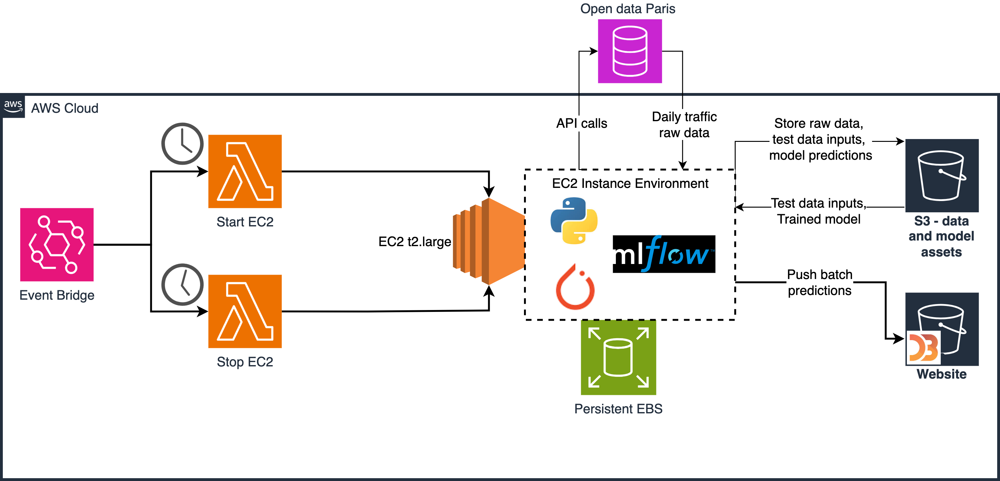

# Traffic Waves

Traffic-Waves is a voluntary project focused on daily traffic predictions in Paris, utilizing data from [Open Data Paris](https://opendata.paris.fr/explore/dataset/comptages-routiers-permanents/information)

## Overview

The project leverages deep learning techniques to analyze historical traffic data and make predictions for daily traffic patterns in Paris. This aids in providing insights for commuters and city planners alike.

### 1. Deployed System on AWS
The system is deployed on AWS, utilizing various services to process and analyze the traffic data efficiently.

1. __AWS EventBridge Trigger for EC2 Instance Start__

	This Lambda function is designed to start an EC2 instance of type t2.large upon receiving an event trigger from AWS EventBridge. The function is intended to automate the process of starting EC2 instances everyday according to specified configurations.

2. __EC2 Instance Bootstrap with Custom User Data__

	This documentation outlines the process of bootstrapping an EC2 instance using custom user data. Upon boot, the instance executes a sequence of scripts to set up a Python environment with the necessary dependencies such as Python 3, PyTorch, MLFlow, and Pandas. Additionally, it sequentially runs specific scripts to initialize the environment and perform further configuration.

	a) __Paris Traffic Data Aggregator__ : This Python script is designed to aggregate real-time traffic data for specified locations in Paris using the Open Paris API. The aggregated data is then merged into a single DataFrame and uploaded to an Amazon S3 bucket as a CSV file for further analysis.

	b) __Data Processing and Upload__: This Python script is designed to run on an EC2 instance to process and upload traffic data to an Amazon S3 bucket. It retrieves data from various CSV files stored in the specified S3 bucket, performs data manipulation and merging operations, and then uploads the processed data back to S3 for further analysis.
	* It merges the static attributes data with the real-time traffic data based on the Paris ID.
	* Timestamps are converted to a numeric time index for temporal analysis.
	* Additional features such as day of the week and hour of the day are extracted from timestamps.
	* Missing values in the real-time traffic data are filled using corresponding values from the historical trends data.

	c) __Inference Script for Traffic Prediction__: This Python script is designed to run on an EC2 instance for making traffic predictions using a pre-trained machine learning model. The script retrieves preprocessed data from an Amazon S3 bucket, loads the pre-trained model using MLflow, performs inference on the test data, and then uploads the prediction results back to the S3 bucket.

	d) __Data Aggregation and Normalization Script__: This Python script is designed to aggregate, normalize, and upload traffic data from various sources to an Amazon S3 bucket. It retrieves real-time traffic data, prediction results from previous days, and prediction results for the current day from the specified S3 bucket, processes and normalizes the data, and then uploads it as a JSON file to another S3 bucket for Web visualization.

	e) __Real-time Traffic Visualization Web Application__: A S3 bucket is configured for static website hosting. A HTML file is used for visualizing real-time traffic data using D3.js. The application fetches traffic data from a JSON file stored in the same Amazon S3 bucket, creates dynamic line plots for each detector (Paris ID), and displays them on the web page. 
	* You can access the daily batch predictions on th [S3 Website](http://traffiq-paris.s3-website.eu-north-1.amazonaws.com/)